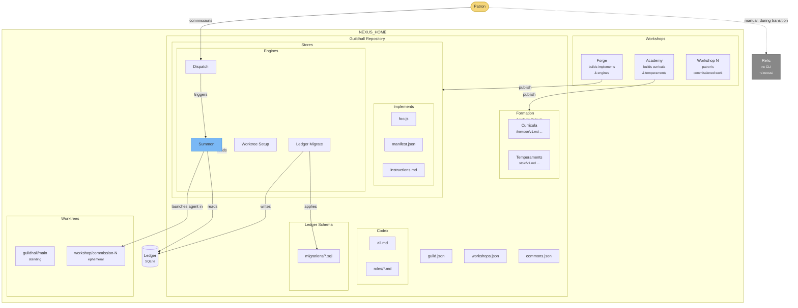
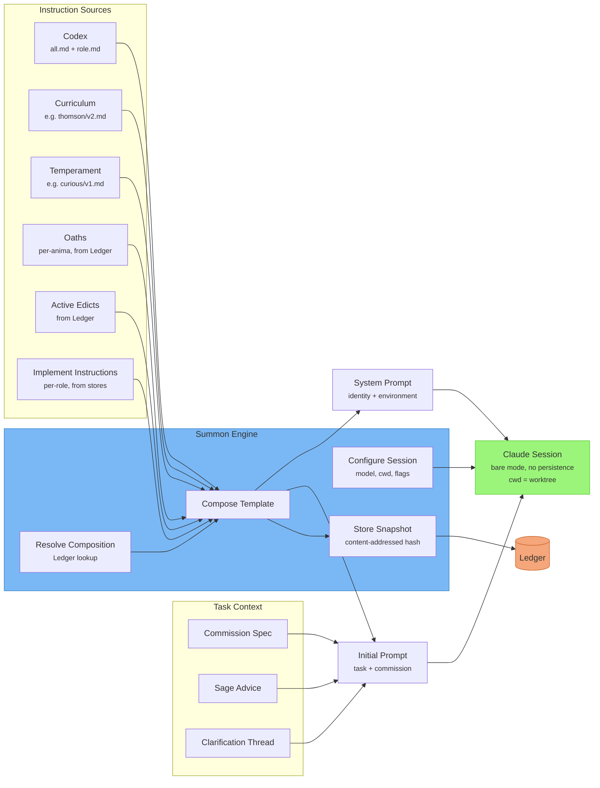
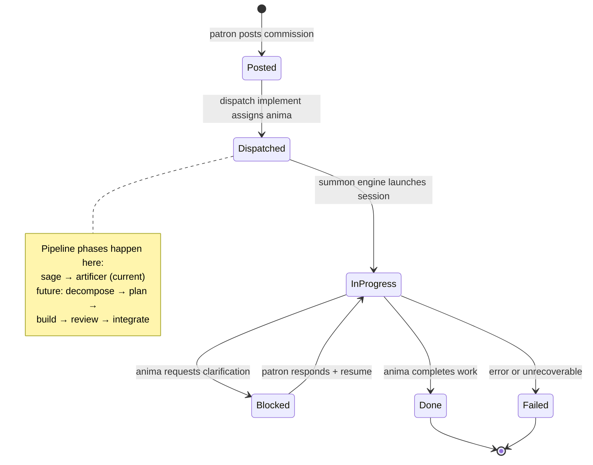

# Guild Architecture — Diagrams

## Overall Guild Architecture

```mermaid
graph TB
    patron([Patron])

    subgraph NEXUS_HOME
        ledger[(Ledger<br/><small>SQLite</small>)]

        subgraph guildhall_repo[Guildhall Repository]
            guild_json[guild.json]
            workshops_json[workshops.json]
            commons_json[commons.json]

            subgraph codex_block[Codex]
                codex_all[all.md]
                codex_roles[roles/*.md]
            end

            subgraph formation[Formation<br/><small>Academy Outputs</small>]
                curricula[Curricula<br/><small>thomson/v1.md ...</small>]
                temperaments[Temperaments<br/><small>stoic/v1.md ...</small>]
            end

            subgraph stores[Stores]
                subgraph implements_block[Implements]
                    impl_bundle[foo.js]
                    impl_manifest[manifest.json]
                    impl_instructions[instructions.md]
                end
                subgraph engines_block[Engines]
                    summon_engine[Summon]
                    worktree_engine[Worktree Setup]
                    dispatch_engine[Dispatch]
                    migrate_engine[Ledger Migrate]
                end
            end

            subgraph schema[Ledger Schema]
                migrations[migrations/*.sql]
            end
        end

        subgraph workshops[Workshops]
            forge[Forge<br/><small>builds implements<br/>& engines</small>]
            academy[Academy<br/><small>builds curricula<br/>& temperaments</small>]
            workshop_n[Workshop N<br/><small>patron's<br/>commissioned work</small>]
        end

        subgraph worktrees[Worktrees]
            guildhall_main[guildhall/main<br/><small>standing</small>]
            wt_commission[workshop/commission-N<br/><small>ephemeral</small>]
        end
    end

    relic[Relic<br/><small>nx CLI</small><br/><small>~/.nexus/</small>]

    patron -->|commissions| dispatch_engine
    dispatch_engine -->|triggers| summon_engine
    summon_engine -->|reads| ledger
    summon_engine -->|reads| guildhall_repo
    summon_engine -->|launches agent in| wt_commission
    migrate_engine -->|applies| migrations
    migrate_engine -->|writes| ledger

    forge -->|publish| stores
    academy -->|publish| formation

    patron -.->|manual, during transition| relic

    style relic fill:#888,stroke:#555,color:#fff
    style patron fill:#f5d67a,stroke:#c9a830
    style summon_engine fill:#7ab8f5,stroke:#3080c9
```

## Instruction Composer (Summon Engine)

```mermaid
graph LR
    subgraph sources[Instruction Sources]
        direction TB
        codex[Codex<br/><small>all.md + role.md</small>]
        curriculum[Curriculum<br/><small>e.g. thomson/v2.md</small>]
        temperament[Temperament<br/><small>e.g. curious/v1.md</small>]
        oaths[Oaths<br/><small>per-anima, from Ledger</small>]
        edicts[Active Edicts<br/><small>from Ledger</small>]
        impl_inst[Implement Instructions<br/><small>per-role, from stores</small>]
    end

    subgraph task[Task Context]
        direction TB
        spec[Commission Spec]
        sage_advice[Sage Advice]
        clarifications[Clarification Thread]
    end

    subgraph summon[Summon Engine]
        direction TB
        resolve[Resolve Composition<br/><small>Ledger lookup</small>]
        template[Compose Template]
        configure[Configure Session<br/><small>model, cwd, flags</small>]
        snapshot[Store Snapshot<br/><small>content-addressed hash</small>]
    end

    codex --> template
    curriculum --> template
    temperament --> template
    oaths --> template
    edicts --> template
    impl_inst --> template

    resolve --> template
    template --> system_prompt[System Prompt<br/><small>identity + environment</small>]
    template --> initial_prompt[Initial Prompt<br/><small>task + commission</small>]

    spec --> initial_prompt
    sage_advice --> initial_prompt
    clarifications --> initial_prompt

    system_prompt --> session
    initial_prompt --> session
    configure --> session

    session[Claude Session<br/><small>bare mode, no persistence<br/>cwd = worktree</small>]

    snapshot --> ledger[(Ledger)]

    template --> snapshot

    style summon fill:#7ab8f5,stroke:#3080c9
    style session fill:#9bf57a,stroke:#5cc930
    style ledger fill:#f5a67a,stroke:#c96830
```

## Commission Lifecycle

```mermaid
stateDiagram-v2
    [*] --> Posted: patron posts commission
    Posted --> Dispatched: dispatch implement assigns anima
    Dispatched --> InProgress: summon engine launches session

    InProgress --> Blocked: anima requests clarification
    Blocked --> InProgress: patron responds + resume

    InProgress --> Done: anima completes work
    InProgress --> Failed: error or unrecoverable

    Done --> [*]
    Failed --> [*]

    note right of Dispatched
        Pipeline phases happen here:
        sage → artificer (current)
        future: decompose → plan →
        build → review → integrate
    end note
```
